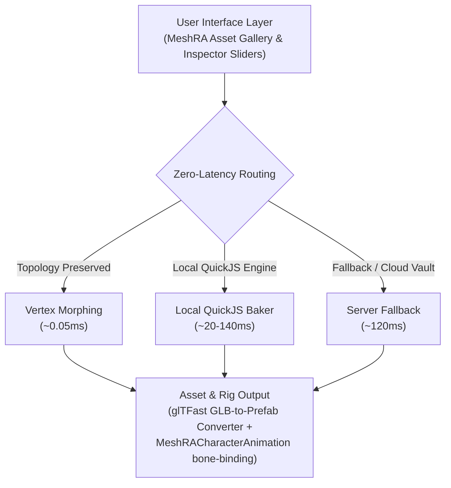

<p align="center">
  
</p>

<h1 align="center">MESHRA</h1>
<h3 align="center">In-Editor Real-Time 3D Asset Studio & Automated Rigging Engine</h3>
<p align="center"><b>Built for the Indian Gaming & AVGC (Animation, Visual Effects, Gaming, & Comics) Ecosystem</b></p>

<p align="center">
  <a href="https://github.com/SKYGOD07/MESHRA">github.com/SKYGOD07/MESHRA</a>
  &nbsp;·&nbsp; <a href="CHANGELOG.md">Changelog</a>
  &nbsp;·&nbsp; <a href="LICENSE.md">MIT License</a>
  &nbsp;·&nbsp; Unity 6000.0+
</p>

---

## 🚀 Pitch Deck Presentation (Innohacks 4.0 Template Format)

> [!IMPORTANT]
> **Track / Theme**: Game Development & Software Innovation / AI Tools  
> **Team Name**: CODE SYNERGY  
> **GitHub Repository**: [SKYGOD07/MESHRA](https://github.com/SKYGOD07/MESHRA)

---

### Slide 1: Title & Team Details

* **Project Title**: **MESHRA**: In-Editor Real-Time 3D Asset Studio & Automated Rigging Engine
* **Track / Theme**: Game Development & Software Innovation / AI Tools
* **Team Name**: **CODE SYNERGY**
* **Team Members**:
  * **Sahil Sharma**
  * **Aditya Pratap Singh Tomar**
  * **Pratyksh Singh Parmar**
  * **Garun Pratap Singh Bhadoriya**

---

### Slide 2: PROBLEM STATEMENT (Tailored to Indian Gaming & Creator Ecosystem)

1. **High Infrastructure Barrier in India’s AVGC Sector**  
   India’s gaming market is projected to reach **$3.1B+ with 500M+ gamers**, yet **90%+ of game assets are imported** due to prohibitive 3D software licensing costs (Maya/3ds Max) and steep hardware workstation requirements.
2. **Tier-2/3 Network & Latency Constraints**  
   Cloud-only 3D generation pipelines rely on high-bandwidth, ultra-low-latency infrastructure. In Indian tier-2/3 indie hubs, cloud mesh baking incurs **120ms–300ms+ latency** and heavy API recurring costs.
3. **Context Switching & Animation Distortion**  
   Student developers and indie studios waste **60%+ of build time context-switching** between external 3D software and Unity. Furthermore, retargeting rigged character models across custom Indian avatar body proportions frequently distorts joint hierarchies and tears meshes.

---

### Slide 3: PROPOSED SOLUTION

* 🎨 **In-Editor 3D Asset Studio (`Ctrl/Cmd + Shift + P`)**  
  A native Unity extension allowing developers to search, parametrically tweak, and instantiate 3D models instantly inside the editor without leaving Unity.
* ⚡ **Zero-Latency Hybrid Baking Engine**  
  Combines local in-editor JavaScript/QuickJS execution (**~20–140ms**) with ultra-fast vertex morphing (**~0.05ms**) to perform instant geometric and color adjustments without relying on paid cloud APIs or internet connectivity.
* 🦴 **Automated Character Rigging & Asset Pipeline**  
  Auto-generates Unity prefabs via `glTFast`, bakes vertex colors into `COLOR_0`, and automatically maps Mixamo animation clips to custom character skeletons without mesh tearing or manual retargeting via `MeshRACharacterAnimation`.

---

### Slide 4: TECH STACK & ARCHITECTURE DIAGRAM



#### Core Stack Specifications:
* **Engine & Frontend**: Unity 6000.0+, C#, Custom Unity Editor Windows & Inspector Controls.
* **Embedded Execution Engine**: QuickJS / PuerTS (in-editor local JavaScript execution without external runtimes).
* **3D Pipeline & Importers**: `com.unity.cloud.gltfast`, three.js catalog runtime, `COLOR_0` vertex-color pipeline.
* **Architecture Flow**:
  1. **User Interface Layer**: MeshRA Asset Gallery (`Ctrl/Cmd + Shift + P`) & Custom Inspector Sliders.
  2. **Zero-Latency Routing**: Vertex Morphing (~0.05ms) $\rightarrow$ Local QuickJS Baker (~20–140ms) $\rightarrow$ Server Fallback (~120ms).
  3. **Asset & Rig Output**: glTFast GLB-to-Prefab Converter + `MeshRACharacterAnimation` bone-binding pipeline.

---

### Slide 5: BUSINESS PLAN

* 🎯 **Target Market**: Indian indie game developers, gaming studio startups, college hackathon teams, and AR/VR ed-tech creators.
* 💳 **Freemium & API Subscription Model**:  
  * **Free Tier**: Local in-editor mesh baking, standard catalog assets, zero API cost.
  * **Premium API Tiers**: Cloud remixing, proprietary model vaults, and team collaboration sync.
* 📈 **Ecosystem Growth**: Distribution through the Unity Asset Store, strategic partnerships with Indian game development institutes, and B2B studio licensing.

---

### Slide 6: THANK YOU

* **Project Name**: MESHRA
* **Team Name**: CODE SYNERGY
* **GitHub Repository**: [SKYGOD07/MESHRA](https://github.com/SKYGOD07/MESHRA)

---

## 📦 Installation & Setup

### Package Manager (Git URL)

In Unity, open **Window ▸ Package Manager ▸ + ▸ Add package from git URL…**:

```
https://github.com/SKYGOD07/MESHRA.git
```

### Dependencies
MESHRA relies on Unity's official glTF & JSON packages:
```
com.unity.cloud.gltfast
com.unity.nuget.newtonsoft-json
```

Or configure directly in `Packages/manifest.json`:
```jsonc
{
  "dependencies": {
    "dev.meshra.unity-connector": "https://github.com/SKYGOD07/MESHRA.git",
    "com.unity.cloud.gltfast": "6.19.0",
    "com.unity.nuget.newtonsoft-json": "3.2.2"
  }
}
```

---

## 🖥️ MESHRA Unity Menu Shortcuts

```text
Tools ▸ MESHRA ▸ Browse Assets                           Ctrl/Cmd + Shift + P
Tools ▸ MESHRA ▸ API Key…
Tools ▸ MESHRA ▸ Welcome
Tools ▸ MESHRA ▸ Setup                                   (Check local QuickJS engine status)
Tools ▸ MESHRA ▸ Update Package                          (Pull latest version from GitHub)
Tools ▸ MESHRA ▸ Diagnostics ▸ Smoke-test local baking   (Bake single model, benchmark timings)
```

The gallery is also available under **Window ▸ MESHRA ▸ Browse Assets**.

---

## 🛠️ Feature Breakdown

### 1. In-Editor Asset Gallery (`Ctrl/Cmd + Shift + P`)
* **Browse**: High-performance thumbnail grid over the catalog, cached locally.
* **Filter**: Search by category, poly budget, free/premium tier, and topological morphability.
* **Preview**: Real-time 3D viewport (orbit, pan, zoom) with instant material feedback.
* **Remix**: Real-time range sliders, colorway chips, and per-slot vertex color pickers.
* **Import**: Writes `.glb` into `Assets/MESHRA/` and instantiates a Unity prefab automatically.

### 2. Zero-Latency Hybrid Baking Performance

| Baking Strategy | Latency | Network Req. | Best Used For |
| :--- | :--- | :--- | :--- |
| **Vertex Morphing** | **~0.05 ms** | 0 (Local) | Real-time continuous slider tweaking during gameplay / editor interaction |
| **Local QuickJS Baker** | **~20–140 ms** | 0 (Local) | Parametric geometry rebuilds inside the Unity Editor without cloud API fees |
| **Server Fallback** | **~120 ms** | 1 (HTTP) | Locked cloud vault assets & heavy server side baking |

### 3. Automated Character Rigging (`MeshRACharacterAnimation`)
* Character models are auto-rigged with standard skeleton hierarchies (Mixamo topology compatibility).
* `MeshRACharacterAnimation` handles playable graph clip transitions without requiring manual AnimatorController setup.
* Rotations are bound dynamically while preserving custom avatar bone lengths, preventing mesh distortion or joint hierarchy tearing across Indian character proportions.
* Vertex colors are baked into `COLOR_0` for zero-material-overhead rendering.

---

## 💻 Runtime C# API Usage

```csharp
using MeshRA;
using UnityEngine;

public class MESHRAExample : MonoBehaviour
{
    async void Start()
    {
        var catalog = FindFirstObjectByType<MeshRACatalog>();
        catalog.Loaded += async () =>
        {
            // Spawn asset dynamically from catalog
            var remixable = await MeshRASpawner.SpawnAsync(catalog, catalog.Next());
            
            // Instant vertex recoloring
            remixable.SetColorway("colorway", "kerosene-red");
            
            // Parametric geometry morph
            remixable.SetRange("tallness", 1.12f);
        };
    }
}
```

---

## 📜 License & Credits

* **License**: MIT License — see [LICENSE.md](LICENSE.md).
* **Developed by**: Team **CODE SYNERGY** (Sahil Sharma, Aditya Pratap Singh Tomar, Pratyksh Singh Parmar, Garun Pratap Singh Bhadoriya).
* **Third Party Components**: See [Third Party Notices.md](Third%20Party%20Notices.md).
